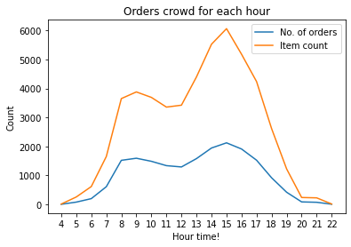
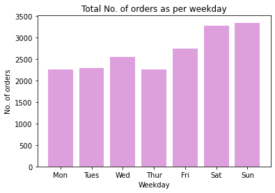
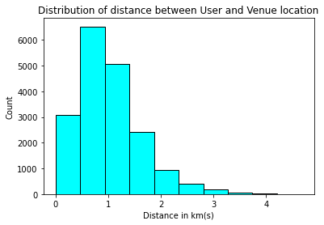
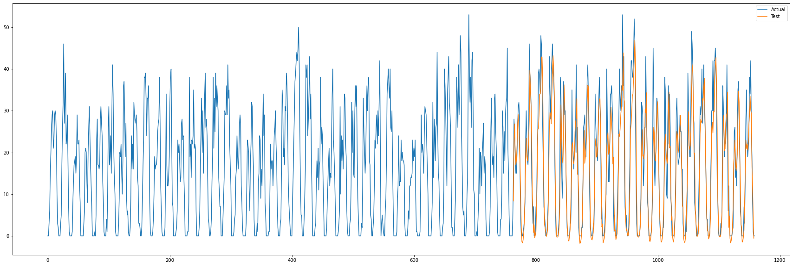
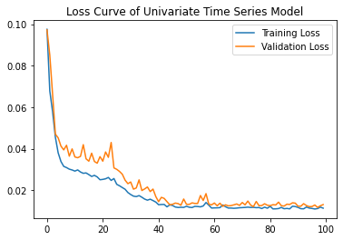
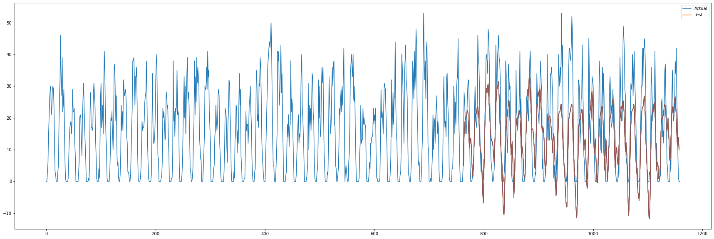
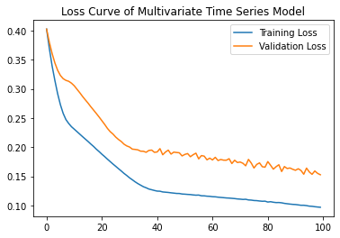

# Data Science Summer Intern assignment 2022

**Assignment for candidates**

## Table of Contents

1. [Data](#data)
2. [Task - Predicting how many orders Wolt may get in next hour](#task)
3. [Data Analysis and Modelling](#data-analysis-and-modelling)
4. [Modelling](#modelling-:rocket:)
5. [Further Development](#further-development)
6. [Working with files](#working-with-files)

----

## Data

* **Time series.** I have choosen this dataset [provided file](orders_autumn_2020.csv) as a process fluctuating in time

---

## Task

* **Forecast No. of orders.** - Building a forecasting model for predicting how many orders WOLT may get in next hour? 

---

## Data Analysis and Modelling

### Data Exploration :chart_with_upwards_trend:

For detail Analysis, go check this [notebook](Analysis.ipynb #Hourly).

Here are same basic insights of data -:

1. **Hourly Analysis** :hourglass:

2. **Weekly Analysis**

3. **Routing Analysis**

### Data Processing

* **Data Deriving**

    - Derive some data fron existing columns such as date, hour, weekday from TIMESTAMP

* **Data Preparation for Modelling**

    - Group data based on date and hour as we are doing hourly prediction, major point here, is for all dates we are not having all hours, like orders are placed between 4am(4 hr) to 10pm(22 hr). So imputed those hours for particular dates.

    - For univariate analysis, one new column called "no_of_orders" was created and whole foecasting model is based on that single columm.

    - For multivariate analysis new column is also used along with weather data.

---

## Modelling :rocket:

I have choosen LSTM for building forecasting model for predicting the no. of orders in next hour...

### Reason of choosing LSTMN

- We are working on timeseries data and in that case we need to keep useful information from previous data and LSTMN has a memory cell which helps in keeping past information also.

- Two models I have built -> Univariate and Multivariate 

- Features for multivariate model -> No. of orders, Weather data(Wind, Precipitation, Cloud Coverage, Temperature) as the no. of orders may depend upon the weather and route[I didnt take into consideration..but can be taken]

### Evaluation :memo:

This the output from the two models -:

1. Univariate

2. Multivariate

-----

## Further development

I have trained two models but seems like univariate is outperforming as the validation loss is better than training loss.

If more time will be there these things could be done -:

    - Missing data for weather can be handled in more efficient way
    - Different model architecture should be tried and thier metrics scores
    - Due to less data, not able to test out on different whole dataset as in the current model, information leakage happened.

------

## Working with files

* **[Analysis.ipynb](Analysis.ipynb)** - *It contains all analysis, with whole 2 models*

* **[utility.py](utility.py)** - *It contains utility functions like creating a dataset, splitting train and test set etc.*

* **[data_processing.py](data_processing.py)** - *It contains all the preprocessing which was mentioned [here](#data-processing)*

* **[univariate_model.py](univariate_model.py)** - *It is data tranform for univariate analysis and model building and plotting the graph*

* **[multivariate_model.py](multivariate_model.py)** - *It is data tranform for multivariate analysis and model building and plotting the graph*

### **How to execute the files/code**

    - One is directly go through/run the python notebook- analysis.ipynb.

    - Else run main.py use the code as per choice for univariate and multivariate model

---

